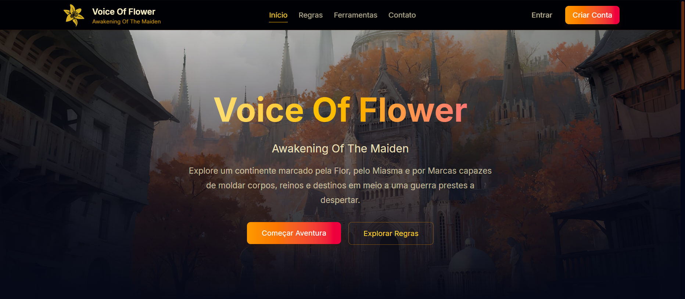
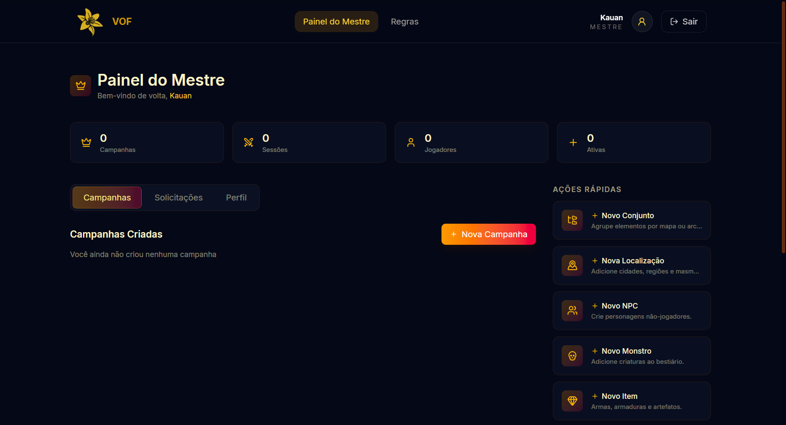
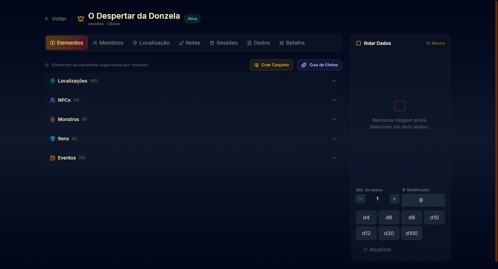
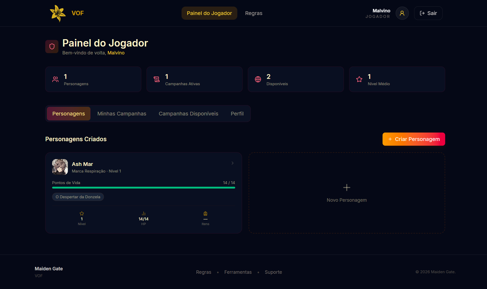
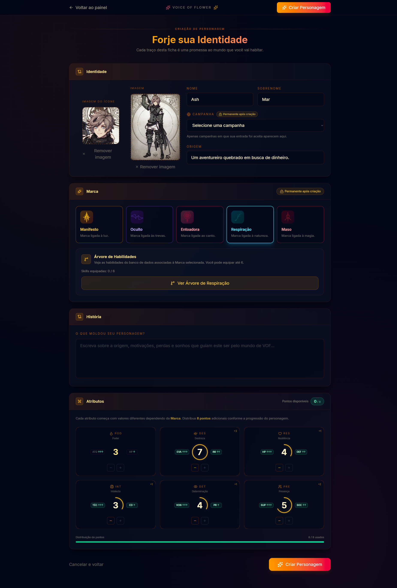
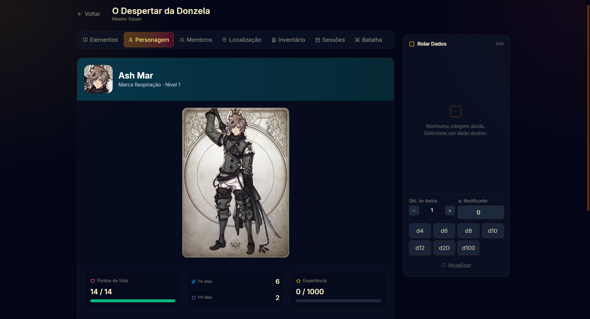

<p align="center">
  <b>Português</b> | <a href="README.en.md">English</a>
</p>

<h1 align="center">Maiden Gate</h1>

<p align="center">
  Plataforma web de suporte para o RPG de mesa autoral <strong>Voice Of Flower: Awakening of the Maiden</strong>.
</p>

<p align="center">
  
  
  
  
  
  
</p>

---

## Sobre o Projeto

**Maiden Gate** é uma aplicação web full stack criada para auxiliar Mestres e Jogadores durante campanhas de RPG de mesa.

A plataforma nasceu da necessidade de substituir anotações espalhadas, planilhas manuais e controles físicos por uma ferramenta digital integrada. O objetivo é tornar a experiência de mesa mais organizada, fluida e imersiva, permitindo que o grupo foque mais na narrativa e menos na administração manual de informações.

Embora tenha sido criada inicialmente para o sistema autoral **Voice Of Flower**, a base da aplicação foi pensada para ser expansível e adaptável a outros sistemas de RPG no futuro.

---

## Prévia do Projeto

### Tela Inicial



### Dashboard do Mestre



### Página de Campanha do Mestre



### Dashboard do Jogador



### Criação de Personagem



### Página de Campanha do Jogador



---

## Sobre Voice Of Flower

**Voice Of Flower: Awakening of the Maiden** é um sistema de RPG de mesa autoral em desenvolvimento, ambientado em um universo de fantasia sombria, política, mistério, Miasma, Marcas e conflitos entre facções.

No sistema, personagens possuem Marcas que influenciam suas habilidades, atributos e papel dentro da narrativa. O Maiden Gate funciona como uma ferramenta digital para testar, organizar e aplicar essas regras durante campanhas reais.

---

## Funcionalidades Principais

### Autenticação e Perfis

- Cadastro e login de usuários.
- Separação entre perfis de **Mestre** e **Jogador**.
- Rotas protegidas por autenticação.
- Interface adaptada conforme o tipo de usuário.

---

## Módulo do Mestre

O Mestre possui um painel completo para criar, editar e gerenciar campanhas.

### Dashboard do Mestre

- Listagem de campanhas criadas.
- Estatísticas gerais.
- Solicitações de entrada de jogadores.
- Aceite ou recusa de jogadores em campanhas.

### Criação de Campanha

- Criação manual de campanhas.
- Uso de campanhas pré-prontas.
- Cadastro de localizações, NPCs, monstros, itens, eventos e sessões.
- Upload de imagens para campanha, localizações, NPCs e monstros.
- Associação de NPCs a Marcas cadastradas no banco de dados.
- Cadastro de status e habilidades para NPCs e monstros.

### Página de Campanha do Mestre

- Visualização completa dos elementos da campanha.
- Controle da localização atual.
- Notas privadas do Mestre.
- Agenda de sessões.
- Visualização dos membros da campanha.
- Visualização de status de NPCs e monstros.
- Gerenciamento de dados principais da campanha.
- Chat compartilhado de rolagem de dados.
- Limpeza do histórico de rolagens pelo Mestre.

---

## Módulo do Jogador

O Jogador possui um painel próprio para gerenciar personagens, campanhas e participação nas sessões.

### Dashboard do Jogador

- Listagem de personagens criados.
- Estatísticas reais baseadas nos personagens.
- Listagem de campanhas em que participa.
- Listagem de campanhas disponíveis.
- Solicitação de entrada em campanhas.

### Criação de Personagem

- Seleção de campanha acessível ao jogador.
- Seleção de Marca vinda do banco de dados.
- Visualização de árvore de habilidades por Marca.
- Equipamento de até 6 habilidades.
- Distribuição de atributos: POD, DES, RES, INT, DET e PRE.
- Cálculo automático de status.
- Upload de duas imagens: imagem do ícone e imagem completa do personagem.
- Salvamento real no backend.

### Página de Campanha do Jogador

- Visualização dos elementos da campanha.
- Visualização de imagens de localizações, NPCs e monstros.
- Visualização de status de NPCs e monstros.
- Visualização dos dados do próprio personagem.
- Visualização dos membros da campanha.
- Visualização da localização atual definida pelo Mestre.
- Inventário funcional: adicionar item, alterar quantidade e remover item.
- Visualização das sessões criadas pelo Mestre.
- Chat compartilhado de rolagem de dados.

---

## Sistema de Rolagem de Dados

O Maiden Gate possui um sistema compartilhado de rolagem de dados entre Mestre e Jogadores.

- Rolagens salvas no backend.
- Histórico compartilhado por campanha.
- Mestre visualiza rolagens dos jogadores.
- Jogadores visualizam rolagens do Mestre e dos outros jogadores.
- Atualização automática por polling.
- Mestre pode limpar todo o histórico da campanha.

---

## Páginas de Regras

Enquanto o livro completo de Voice Of Flower ainda está em desenvolvimento, o projeto possui páginas de regras resumidas:

- Regras públicas gerais.
- Regras específicas para Mestres.
- Regras específicas para Jogadores.
- Interface em abas com conteúdo essencial.
- Botão de download exibido como indisponível até a finalização do livro.

---

## Responsividade

O projeto possui ajustes específicos para telas menores:

- Menu mobile na página inicial.
- Menu mobile nas páginas autenticadas.
- Abas de campanha adaptadas para seletor mobile.
- Layout responsivo para dashboards, cards, elementos e formulários.

---

## Tecnologias Utilizadas

### Frontend

<p>
  
  
  
  
  
  
</p>

### Backend

<p>
  
  
  
  
</p>

### Ferramentas de Desenvolvimento

<p>
  
  
  
  
  
</p>

---

## Como Executar o Projeto

### Backend

```bash
cd backend
composer install
cp .env.example .env
php artisan key:generate
php artisan migrate
php artisan storage:link
php artisan serve
```

### Frontend

```bash
cd frontend
npm install
npm run dev
```

---

## Variáveis de Ambiente

### Frontend

Crie um arquivo `.env` no frontend:

```env
VITE_API_URL=http://127.0.0.1:8000/api
```

### Backend

Configure no `.env` do Laravel:

```env
APP_NAME=MaidenGate
APP_URL=http://127.0.0.1:8000

DB_CONNECTION=pgsql
DB_HOST=127.0.0.1
DB_PORT=0000
DB_DATABASE=seu_db
DB_USERNAME=seu_usuario
DB_PASSWORD=sua_senha
```

---

## Estrutura Geral

```txt
maiden-gate/
├── backend/
│   ├── app/
│   ├── database/
│   ├── routes/
│   └── ...
│
├── frontend/
│   ├── src/
│   │   ├── features/
│   │   ├── shared/
│   │   ├── routes/
│   │   └── services/
│   └── ...
│
└── README.md
```

---

## Status do Projeto

O projeto está em fase de **MVP funcional**.

Grande parte das funcionalidades principais já está implementada:

- autenticação;
- dashboards;
- criação de campanhas;
- criação de personagens;
- páginas de campanha;
- inventário;
- rolagem de dados compartilhada;
- páginas de regras;
- responsividade.

As próximas etapas envolvem principalmente:

- ajustes de interface;
- revisão de textos e placeholders;
- testes finais;
- correção de bugs;
- preparação para deploy.

---

## Roadmap

- [x] Autenticação de usuários.
- [x] Separação entre Mestre e Jogador.
- [x] Dashboard do Mestre.
- [x] Dashboard do Jogador.
- [x] Criação de campanhas.
- [x] Campanhas pré-prontas.
- [x] Criação de personagens.
- [x] Upload de imagens.
- [x] Inventário funcional.
- [x] Sessões de campanha.
- [x] Chat compartilhado de dados.
- [x] Páginas de regras.
- [x] Interface mobile.
- [ ] Revisão final de UI/UX.
- [ ] Ajuste de textos e descrições.
- [ ] Testes finais.
- [ ] Deploy.

---

## Observações

- O livro completo de regras de Voice Of Flower ainda está em desenvolvimento.
- Algumas regras e textos podem mudar conforme o sistema evolui.
- A aba de batalha ainda está marcada como **Em desenvolvimento**.
- O projeto foi criado como ferramenta prática para apoiar campanhas reais e também como projeto de portfólio full stack.

---

## Autor

Desenvolvido por **Kauan Malvino Garcia**.

- GitHub: [malvino11-28](https://github.com/malvino11-28)
- LinkedIn: [Malvino Garcia](https://www.linkedin.com/in/malvino-garcia)
